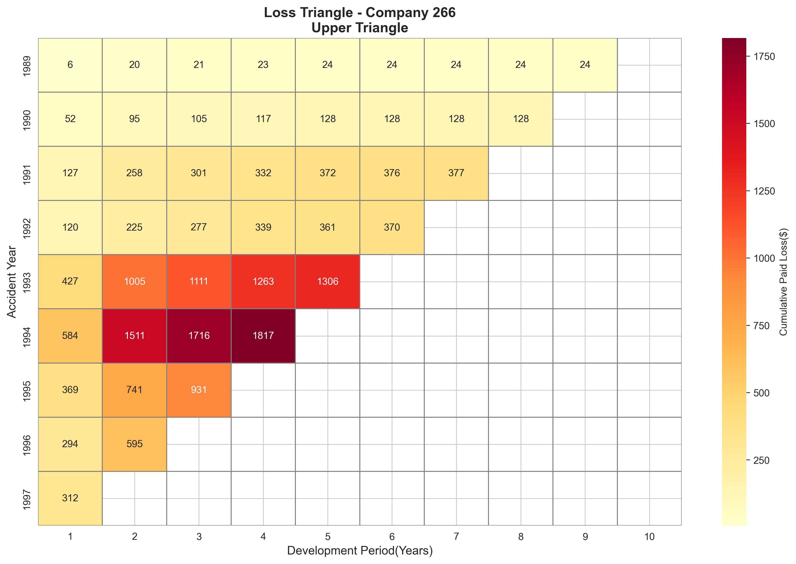
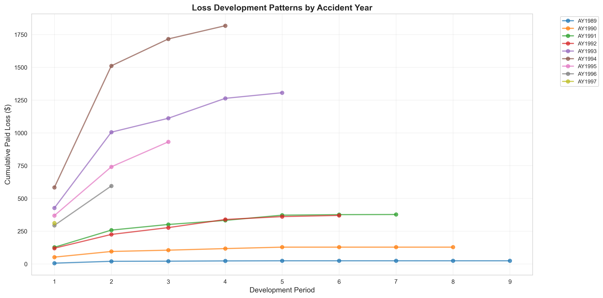
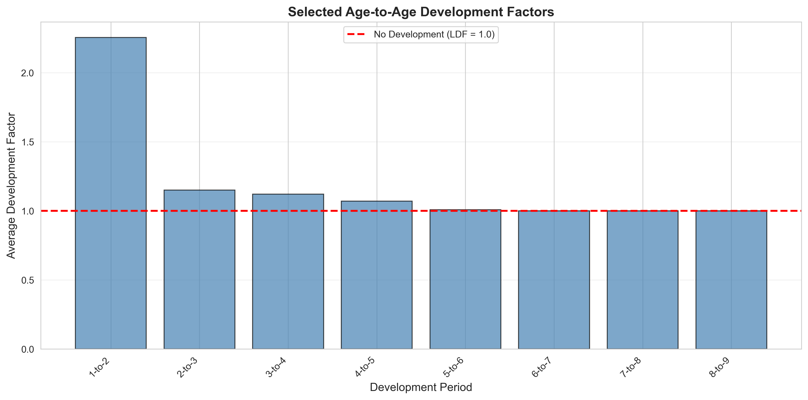
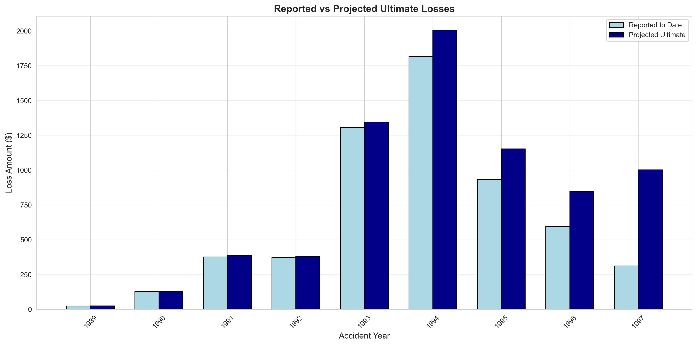
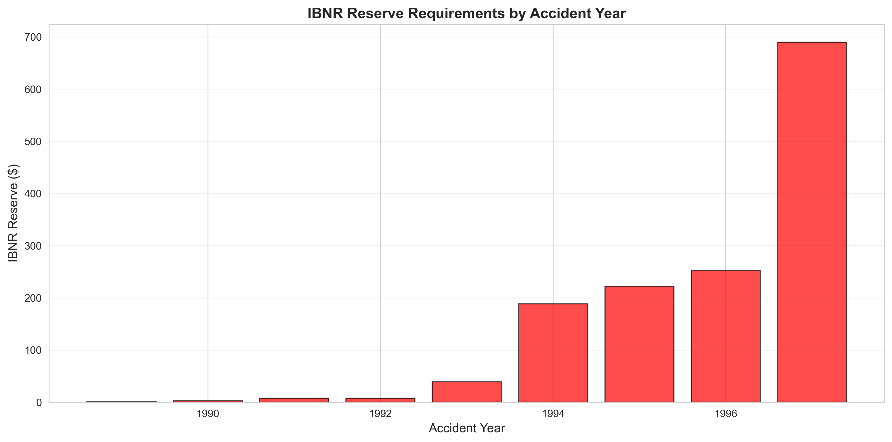
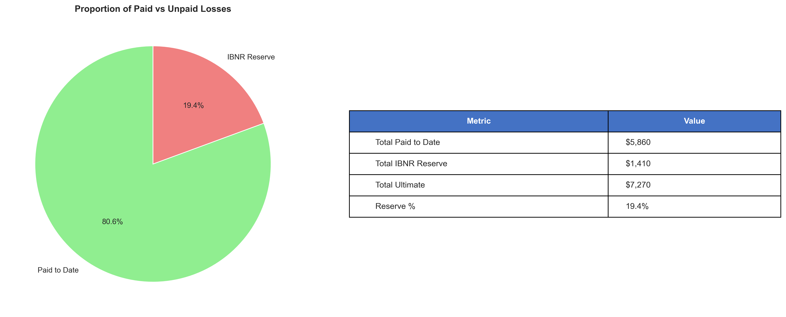
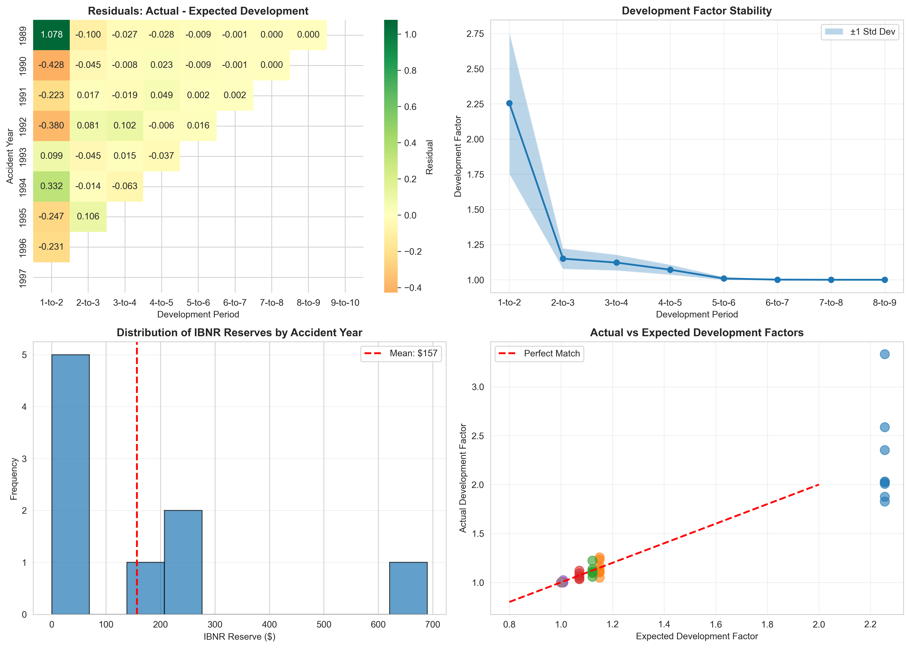

# Loss Reserving Analysis - Chain Ladder Method

**Author:** Lavanya Khurana  
**Date:** November 2025  
**Purpose:** P&C Actuarial Analysis Project

## Overview

Implemented industry-standard Chain Ladder loss reserving method on actual 
CAS Schedule P insurance data to project ultimate losses and estimate 
IBNR (Incurred But Not Reported) reserves.

## Key Findings

- **Total IBNR Reserve Required:** $1409.51
- **Reserve-to-Paid Ratio:** 24.05%
- **Most Development:** First 3-4 years (early reporting/settlement)
- **Methodology:** Industry-standard Chain Ladder approach

## What is Loss Reserving?

Insurance companies must estimate how much they'll ultimately pay for 
claims that have already occurred but aren't fully paid. This analysis 
projects ultimate losses using historical development patterns.

## Methodology: Chain Ladder
The Chain Ladder method projects ultimate losses based on historical development patterns.
**Core Assumption:** "Claims from recent years will develop similarly to how older years developed."

**Process:**
1. **Construct Loss Triangle** - Organize claims by accident year and development period
2. **Calculate Development Factors** - Measure how losses grow over time
3. **Select Factors** - Average historical patterns across years
4.**Project Ultimate Losses** - Apply factors to incomplete years
5. **Calculate IBNR Reserves** - Ultimate minus reported equals reserve needed
6. **Perform Diagnostic Testing** - Validate assumptions through residuals, trends, and confidence intervals

## Data Source
**CAS Schedule P - Commercial Auto Claims**
- **Source:** NAIC regulatory filings from U.S. property-casualty insurers
- **Authors:** Meyers, G. G., & Shi, P. (2011
- **Coverage:** Accident years 1988-1997, 10 years of development
- **Data Type:** Cumulative paid losses (net of reinsurance)

## Files

- `loss_reserving_analysis.ipynb` - Complete Python analysis
- `Loss Reserving Analysis Report.pdf` - Technical report with findings
- `loss_triangle_upper.csv` - Loss development triangle
- `reserve_estimates.csv` - Projected reserves by accident year
- `development_factors.csv` - Age-to-age factors showing claims development over time

## Visualizations

### Loss Triangle Heatmap

Shows cumulative paid losses by accident year and development period.

### Development Patterns

Illustrates how losses develop over time for each accident year.

### Development Factors

Shows average growth rates between development periods.

### Ultimate Losses Projection

Compares reported-to-date vs projected ultimate losses.

### IBNR Reserves

Shows incurred but not reported reserve requirements by accident year.

### Reserve Summary

Provides overview of paid vs unpaid losses with key reserve metrics.

### Diagnostic Analysis

Displays residual patterns, factor stability, IBNR distribution, and actual vs expected development validation.

## Technical Details

**Language:** Python 3.12.7
**Libraries:** pandas, numpy, matplotlib, seaborn  

**Key Calculations:**
- Age-to-age factors (LDFs)
- Cumulative development factors (CDFs)
- Ultimate loss projections
- IBNR reserve calculations
- Diagnostic validation tests

## What I Learned
**Technical Skills**
- Python for actuarial analysis (pandas, data manipulation)
- Statistical visualization and interpretation
- Chain Ladder methodology implementation
- Diagnostic testing and model validation

**Actuarial Concepts**
- Claims development dynamics
- Age-to-age and cumulative development factors
- Upper triangle masking for realistic scenarios
- Reserve estimation and validation

## Real-World Application

This methodology is used by P&C actuaries for:

- **Financial Reporting:** GAAP/IFRS required valuations
- **Regulatory Compliance:** State insurance department filings
- **Pricing & Underwriting:** Understanding true costs
- **Risk Management:** Capital allocation and reinsurance decisions

The Chain Ladder method shown here is the industry standard recognized by the Casualty Actuarial Society and regulatory bodies worldwide.

## Limitations

- Single company aggregate (real work analyzes hundreds separately)
- Simple average factors (could use weighted average)
- Simplified tail factor (professional models are more sophisticated)
- No segmentation by coverage type, state, or policy characteristics
- Deterministic approach (no stochastic modeling)

## References

- CAS Loss Reserve Database
- Loss Reserving page at Wikipedia including Chain Ladder Method
- Chain Ladder Literature

---

Contact: [khurana.lavanya7@gmail.com] 
